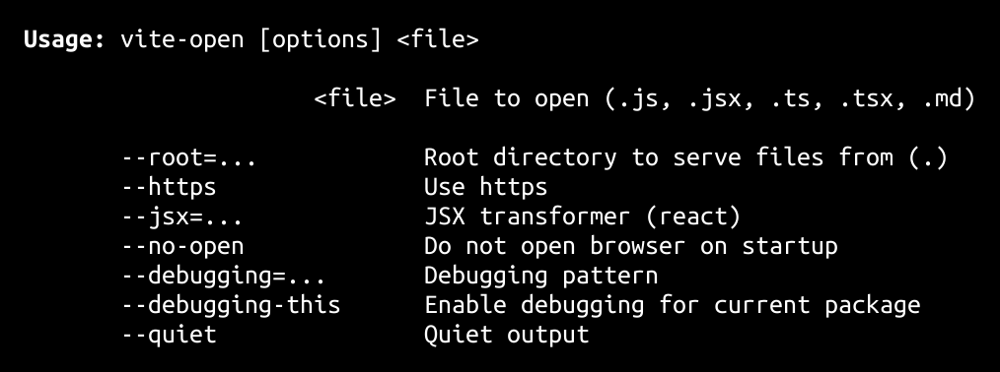

<h1>
vite-open   
</h1>

Open any file directly in a Vite dev server.

<h4>
<table><tr><td title="Triple click to select and copy paste">
<code>npm i vite-open -g</code>
</td><td title="Triple click to select and copy paste">
<code>pnpm add vite-open -g</code>
</td><td title="Triple click to select and copy paste">
<code>yarn global add vite-open</code>
</td></tr></table>
</h4>

## CLI

<h2>Features</h2>
<ul>
<li><strong><em>Zero config, zero setup</em></strong>. Open <code>.js</code> <code>.jsx</code> <code>.ts</code> <code>.tsx</code> <code>.md</code> and <code>.html</code> files directly.</li>
<li><strong><em>Vite</em></strong> configured for development, <strong><em>all ESNext features</em></strong> and accurate sourcemaps.</li>
<li>Strict CORS headers enabling <strong><em>all Web features</em></strong>.</li>
<li>Compile time pattern-based <strong><em>debugging</em></strong> using <a href="https://github.com/stagas/rollup-plugin-debug">rollup-plugin-debug</a>.</li>
<li>Open files in VSCode by <strong><em>clicking links directly</em></strong> in Chrome DevTools using the <a href="https://github.com/generalov/open-in-editor-extension">open-in-editor</a> Chrome extension <em>(installed separately)</em>.</li>
<li><strong><em>QR code</em></strong> display with the external address for easy access by phone.</li>
</ul>

## API

## Credits

- [@babel/core](https://npmjs.org/package/@babel/core) by [The Babel Team](https://babel.dev/team) &ndash; Babel compiler core.
- [@babel/plugin-proposal-class-properties](https://npmjs.org/package/@babel/plugin-proposal-class-properties) by [The Babel Team](https://babel.dev/team) &ndash; This plugin transforms static class properties as well as properties declared with the property initializer syntax
- [@babel/plugin-proposal-decorators](https://npmjs.org/package/@babel/plugin-proposal-decorators) by [The Babel Team](https://babel.dev/team) &ndash; Compile class and object decorators to ES5
- [@babel/plugin-proposal-private-methods](https://npmjs.org/package/@babel/plugin-proposal-private-methods) by [The Babel Team](https://babel.dev/team) &ndash; This plugin transforms private class methods
- [@babel/plugin-transform-react-jsx](https://npmjs.org/package/@babel/plugin-transform-react-jsx) by [The Babel Team](https://babel.dev/team) &ndash; Turn JSX into React function calls
- [@babel/plugin-transform-typescript](https://npmjs.org/package/@babel/plugin-transform-typescript) by [The Babel Team](https://babel.dev/team) &ndash; Transform TypeScript into ES.next
- [@stagas/chalk](https://npmjs.org/package/@stagas/chalk) by [@stagas](@stagas/chalk) &ndash; Terminal string styling done right (+ CommonJS build)
- [@vitejs/plugin-basic-ssl](https://npmjs.org/package/@vitejs/plugin-basic-ssl) by [Evan You and Vite Contributors](https://github.com/vitejs) &ndash; undefined
- [decarg](https://npmjs.org/package/decarg) by [stagas](https://github.com/stagas) &ndash; decorator based cli arguments parser
- [everyday-node](https://npmjs.org/package/everyday-node) by [stagas](https://github.com/stagas) &ndash; Everyday node utilities.
- [github-markdown-css](https://npmjs.org/package/github-markdown-css) by [Sindre Sorhus](https://sindresorhus.com) &ndash; The minimal amount of CSS to replicate the GitHub Markdown style
- [open-in-editor-connect](https://npmjs.org/package/open-in-editor-connect) by [Evgeniy V. Generalov](https://github.com/generalov) &ndash; Open in editor middleware
- [qrcode-terminal](https://npmjs.org/package/qrcode-terminal) by [gtanner](https://github.com/gtanner) &ndash; QRCodes, in the terminal
- [rollup-plugin-debug](https://npmjs.org/package/rollup-plugin-debug) by [stagas](https://github.com/stagas) &ndash; Console debug statements that can be pattern toggled at compile time from comments in the code.
- [running-at](https://npmjs.org/package/running-at) by [Maximilian Schiller](https://github.com/BetaHuhn) &ndash; Get local and network ip address
- [vite](https://npmjs.org/package/vite) by [Evan You](https://github.com/vitejs) &ndash; Native-ESM powered web dev build tool
- [vite-plugin-babel](https://npmjs.org/package/vite-plugin-babel) by [Miłosz Mandowski](https://github.com/owlsdepartment) &ndash; Runs Babel in Vite during all commands
- [vite-plugin-markdown](https://npmjs.org/package/vite-plugin-markdown) by [Kengo Hamasaki](https://github.com/hmsk) &ndash; Import markdown files in vite
- [vite-plugin-virtual](https://npmjs.org/package/vite-plugin-virtual) by [patak-js](https://github.com/patak-js) &ndash; Virtual modules with HMR invalidation plugin for Vite

## Contributing

[Fork](https://github.com/stagas/vite-open/fork) or [edit](https://github.dev/stagas/vite-open) and submit a PR.

All contributions are welcome!

## License

<a href="LICENSE">MIT</a> &copy; 2022 [stagas](https://github.com/stagas)
